# Architectural Styles

## Introduction

The architectural style of churches throughout the ages has been influenced by the techniques and technologies available to the architects of the time, as well as the movements that set the trends in architecture.

The history of church architecture in England effectively begins in 597 AD, when the monk Augustine of Canterbury became the first Archbishop of Canterbury.  So, any English history prior to that is not considered, thus the main periods of English history of relevance are:

- Early Medieval / Anglo-Saxon (597–1066)
- Medieval / Middle Ages (1066–1485)
- Tudors (1485–1603)
- Stuarts (1603–1714)
- Georgians (1714–1837)
- Victorians (1837–1901)

## Anglo-Saxon (597-1066)

Early Anglo-Saxon buildings in Britain were generally simple, constructed mainly using timber with thatch for roofing. The use of stone for building construction by the Anglo-Saxons was unusual before c. 950 AD, but there are exceptions. Thus many Anglo-Saxon churches were made of wood and so no longer survive; they were generally replaced with stone constructions after the Norman conquest of Britain.

However, some places of worship were built in stone, these were often 'minster' - or monastic - churches that have over time become parish churches. Anglo-Saxon churches had a simple plan comprising a rectangular nave adjoining a rectangular chancel.

The Anglo-Saxons were not great stonemasons, they applied the same techniques used for wood construction to stone.  For example, Anglo-Saxon windows are very distinctive, a triangular-headed one is likely to be Anglo-Saxon work (it is thought that the design worked well in wood, so the masons were in effect using planks of stone). Other windows have round heads and can often be distinguished from Norman windows by disproportionately large surrounding stones. Or they may have crude little turned pillars or 'balusters' (1) either side.

Anglo-Saxon churches are characterised by:

- semi-circular arches over doors and windows or triangular-headed doorways and windows
- tall and narrow doorways
- windows that have small external openings but are deeply splayed through to the inside
- walls that are no more than 90cm thick
- strip-work on wall surfaces
- herringbone style stonework can be found in the late Saxon/early Norman buildings
- long-and-short quoins (2) (large, tall upright stones alternating with broad flat stones)

Christian churches have been present in Shropshire since the Anglo-Saxon era, an unknown number were built during this time. Very few surviving churches have retained Saxon features, the best example being St Giles, Barrow - founded on the estates of one of England's earliest monasteries, Wenlock Abbey (later Priory), probably in the 8th Century it was used as a small stone oratory, or 'cell', for solitary prayer.

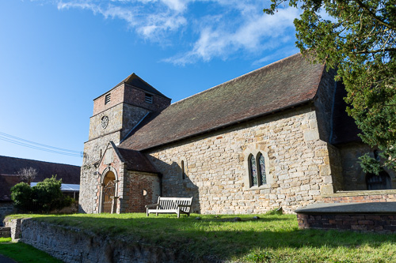

The earliest parts of St Andrew, Wroxeter are Anglo-Saxon but the precise date of its foundation is uncertain (thought to be 5th or 6th Century).

Another example of a church from this period is St Peter, Diddlebury - it is one of about 20 churches in Shropshire mentioned in the Domesday book and therefore of known Saxon origin.

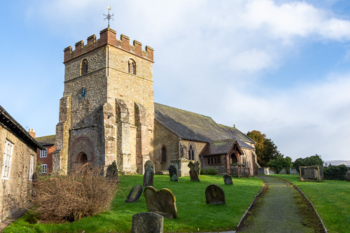

Finally, St Peter, Stanton Lacy is another example of a church built prior to the Norman conquest of Britain.

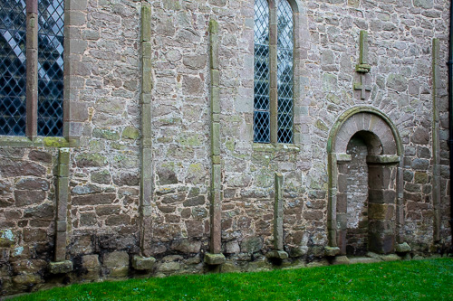

*1: The term ‘baluster shaft’ is given to the shaft dividing a window in Anglo-Saxon architecture.*

*2: A quoin is both the external angle or corner of a building and, more often, one of the stones used to form that angle. These cornerstones are both decorative and structural, since they usually differ in jointing, colour, texture, or size from the masonry of the adjoining walls.*

## Norman (1066-1160)

Also known as English Romanesque architecture, the Normans were primarily responsible for introducing this style of architecture following the conquest of Britain. The change did not happen immediately, however, and so buildings from the last 30 years of the 11th Century show Saxon and Norman influence.  From 1100 AD the Saxon influence ceased to exist in buildings.

The Norman arch is the defining feature of Norman architecture. Norman arches are semi-circular. Early examples have plain, square edges; later ones are often enriched with the zig-zag and roll mouldings (3). The arches are supported on massive columns, generally plain and cylindrical, sometimes with spiral decoration; occasionally, square-section piers were used. Main doorways have a succession of receding semi-circular arches, often decorated with mouldings, typically of chevron or zig-zag design; sometimes there is a tympanum (4) at the back of the head of the arch, which may feature sculpture representing a Biblical scene.

Norman windows are mostly small and narrow, generally of a single round-headed light; but sometimes, especially in a bell tower, divided by a shaft into two lights.

The main characteristics of Norman architecture are:

- best described as powerful and masculine
- defined by semi-circular arches
- deeply recessed doorways
- thick walls
- massive round pillars
- vaulted ceilings
- ornaments such as zigzag moulding and bird and animal forms

In Shropshire, most medieval churches date from the 12th or 13th Centuries, i.e. they are Norman, Transitional (see below) or Early English Gothic (see below). A growing population in the 12th and 13th Centuries meant that some existing churches were extended (typically, laterally by adding arcades).

Holy Trinity, Much Wenlock, the chancel and nave are Norman and the tower is Transitional.

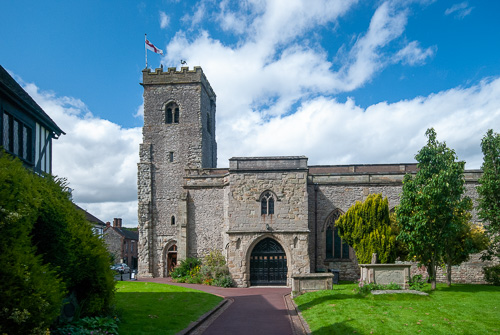

St Mary, Edstaston, is another example of a Shropshire church which dates from the Norman period and which retains many Norman features.

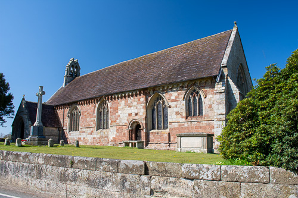

St Gregory, Morville, retains almost all of its Norman features.

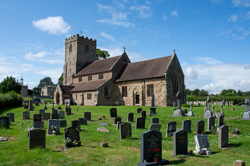

*3: A molding, also spelled moulding, in architecture and the decorative arts, is a defining, transitional, or terminal element that contours or outlines the edges and surfaces on a projection or cavity, such as a cornice, architrave, capital, arch, base, or jamb.*

*4: A tympanum, plural tympana, in Classical architecture, is the area enclosed by a pediment (5), whether triangular or segmental. In a triangular pediment, the area is defined by the horizontal cornice along the bottom and by the raking (sloping) cornice along the sides; in a segmental pediment, the sides have segmental cornices.*

*5: A pediment, in architecture, is triangular gable forming the end of the roof slope over a portico (the area, with a roof supported by columns, leading to the entrance of a building); or a similar form used decoratively over a doorway or window.*

## Transitional (1160-1200)

The term Transitional is used to denote the merging of one style with another, especially the 12th Century transition from Romanesque to Gothic.

St Mary, Bitterley is one of Shropshire's churches that dates from the Transitional period and St Michael, High Ercall, is another example.

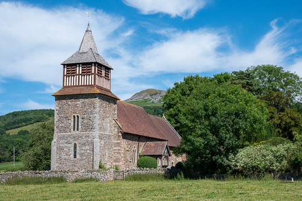

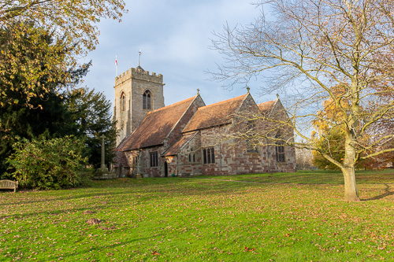

## Gothic (c. 1200 - c. 1550)

The Gothic period breaks down into three periods.

### Early English – c. 1200 - c. 1300

The Normans had introduced the three classical orders of architecture (Doric, Ionic, and Corinthian), and created massive walls for their buildings, with thin pilaster-like buttresses. The transition from Norman to Gothic lasted from about 1145 until 1190, the style changed from the massive Norman style to the more delicate and refined Gothic. The Gothic style was also introduced from France.

The most distinctive element of this period was the pointed arch, also known as the lancet arch, which was the key feature of the rib vault (the skeleton of arches or ribs on which masonry was laid to form a ceiling or roof). The original purpose of the rib vault was to allow a heavier stone ceiling, to replace the wooden roofs of the earlier Norman churches, which frequently caught fire. Rib vaults also had the benefit of allowing the construction of higher and thinner walls. Gradually, pointed arches were used not only for rib vaults, but also for all of the arcades and for lancet windows, giving the nave its unified appearance.

The Early English rib vaults were usually quadripartite, i.e. each vault had four compartments divided by ribs, with each covering one bay of the ceiling (a vault is a structural member consisting of an arrangement of arches, usually forming a ceiling or roof). The horizontal ridge ribs intersected the summits of the cross ribs and diagonal ribs, and carried the weight outwards and downwards to pillars or columns of the triforium (6) and arcades, and, in later constructions, outside the walls to the buttresses  (7).

The buttress was another important innovation introduced in this period, a stone column outside the structure that reinforced the walls against the weight pressing outward and downward from the vaults. This evolved into the flying buttress, which carried the thrust from the wall of the nave over the roof of the aisle. The buttress was given further support by a heavy stone pinnacle.

Early English architecture is also typified by lancet windows, tall narrow lights topped by a pointed arch (Early English Gothic is sometimes known as the Lancet style). They were oftren grouped together side by side under a single arch and decorated with mullions (8) in tracery (9) patterns, such as cusps, or spear-points.

Stained glass windows began to be widely used in the windows of the clerestory, transept and especially the west facade.

Unlike the more sombre and heavy Norman churches, the Gothic churches began to have elaborate sculptural decoration. The arches of the arcades and triforium were sometimes decorated with dog tooth patterns, cusps, carved circles, and with trefoils (12), quatrefoils (13), as well as floral and vegetal designs. Simple floral motifs also often appeared on the capitals (11), the spandrels (10) and the roof bosses that joined the ribs of the vaults.

Also, instead of being massive, solid pillars, early Gothic columns were often composed of clusters of slender, detached shafts, which descended from the vaults above.

In Shropshire, most medieval churches date from the 12th or 13th Centuries.

St Mary, Acton Burnell, is considered to be the finest Early English church in Shropshire (as unlike most English parish churches it is built in the one style).  At St Peter, Cound, the nave, chancel arch and south aisle are Early English.

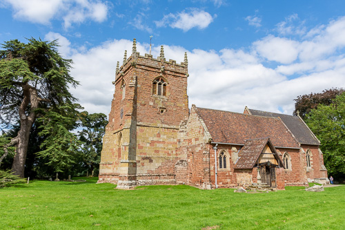

*6: A triforium is an interior gallery, opening onto the tall central space of a building at an upper level. In a church, it opens onto the nave from above the side aisles; it may occur at the level of the clerestory windows, or it may be located as a separate level below the clerestory.*

*7: A buttress is an architectural structure built against or projecting from a wall which serves to support or reinforce the wall.*

*8: A mullion is a vertical element that forms a division between units of a window or screen, or is used decoratively. When dividing adjacent window units its primary purpose is a rigid support to the glazing of the window. Its secondary purpose is to provide structural support to an arch or lintel above the window opening.*

*9: Tracery is an architectural device by which windows (or screens, panels, and vaults) are divided into sections of various proportions by stone bars or ribs of moulding. Most commonly, it refers to the stonework elements that support the glass in a window. The term probably derives from the tracing floors on which the complex patterns of windows were laid out in late Gothic architecture. Tracery can also be found on the interior of buildings and the exterior.*

*10: A spandrel is a roughly triangular space, usually found in pairs, between the top of an arch and a rectangular frame; between the tops of two adjacent arches or one of the four spaces between a circle within a square. They are frequently filled with decorative elements.*

*11: A capital is the crowning member of a column, pier, anta, pilaster, or other columnar form, providing a structural support for the horizontal member or arch above. In the Classical styles, the capital is the architectural member that most readily distinguishes the order.*

*12: A trefoil (from the Latin trifolium, ‘three-leaved plant’) is a graphic form composed of the outline of three overlapping rings, used in architecture and Christian symbolism, among other areas.*

*13: A quatrefoil is a decorative element consisting of a symmetrical shape which forms the overall outline of four partially overlapping circles of the same diameter. It is found in art, architecture, heraldry and traditional Christian symbolism. The word ‘quatrefoil’ means ‘four leaves’, from the Latin quattuor, ‘four’, plus folium, ‘leaf’.*

### Decorated – c. 1300 - c. 1350

The second style of English Gothic architecture is generally termed Decorated Gothic, because the amount of ornament and decoration increased dramatically. It was a period of growing prosperity in England, and this was expressed in the decoration of Gothic buildings. Almost every feature of the interiors and facades was decorated.

Lierne Vaulting (14) became much more elaborate in this period. The rib vault of Early English usually had just four compartments, with a minimum number of ribs which were all connected to the columns below, and all played a role in distributing the weight and outwards and downwards. In the Decorated architecture period, additional ribs were added to the vaulted ceilings which were purely decorative. They created very elaborate star patterns and other geometric designs. An even more elaborate form - fan vaulting, appeared late in the Decorative period, unlike the lierne vault, the fan vault had no functional ribs; the visible 'ribs' are mouldings on the masonry imitating ribs. The structure is instead composed of slabs of stone joined together into half-cones.

The buttress became more common in this period, also; these are the stone columns outside the walls which supports them, allowing thinner and higher walls between the buttresses, and larger windows. The buttresses were often topped by ornamental stone pinnacles to give them greater weight.

However, Decorated architecture is particularly characterised by the elaborate tracery within the stained glass windows. The elaborate windows are subdivided by closely spaced parallel mullions (vertical bars of stone), usually up to the level at which the arched top of the window begins. The mullions then branch out and cross, intersecting to fill the top part of the window with a mesh of elaborate patterns called tracery, typically including trefoils and quatrefoils. The style was geometrical at first and curvilinear, or curving and serpentine, in the later period, This curvilinear element was introduced in the first quarter of the 14th century and lasted about fifty years.

There are relatively few Decorated or Perpendicular churches in Shropshire, as the pace of building churches slowed down during the 14th and 15th Centuries.  However, many existing churches were extended during this time, in particular, many towers were are added or made taller.  The nave and chancel at St Peter, Chelmarsh, are Decorated.

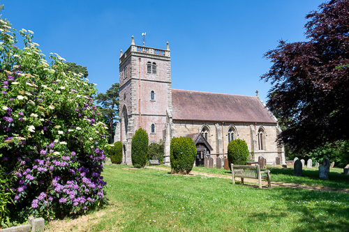

*14: A lierne is a tertiary rib connecting one rib to another, as opposed to connecting to a springer, or to the central boss. The resulting construction is called a lierne vault or stellar vault (named after the star shape generated by connecting liernes). The term lierne comes from the French lier (to bind).*

### Perpendicular – 1350-1550

The Perpendicular style emerged in the mid-14th Century, it is characterised by an emphasis on vertical lines. The intricate shapes of the Decorated style gave way to more regular and rectangular shapes.

Walls were built much higher than in earlier periods. Windows became very large, sometimes of immense size, with slimmer stone mullions than in earlier periods, allowing greater scope for stained glass craftsmen. The mullions of the windows are carried vertically up into the arch moulding of the windows, and the upper portion is subdivided by additional mullions (supermullions) and transoms (15), forming rectangular compartments, known as panel tracery.

The interiors of Perpendicular churches were filled with lavish ornamental woodwork, including misericords, under which were grotesque carvings; stylized 'poppy heads'; and elaborate multicoloured decoration, usually in floral patterns, on panels or cornices (brattishing (16)). Tracery designs were replaced by more geometric forms and perpendicular lines.

The Black Death affected the Perpendical style as arts and culture, took a more sober direction.

Towers were an important feature of the Perpendicular style, though fewer spires were built than in earlier periods. Decorative Battlements were a popular decoration of towers in smaller churches.

Doorways were frequently enclosed within a square head over the arch mouldings, the spandrels being filled with quatrefoils or tracery. Pointed arches were still used throughout the period, but ogee (17) and four-centred Tudor arches (18) were also introduced.

Inside the church the triforium disappeared, or its place was filled with panelling, and greater importance was given to the clerestory windows, which often were the finest features in the churches of this period. The mouldings were flatter than those of the earlier periods, and one of the chief characteristics is the introduction of large elliptical hollows.

In Shropshire in the 14th Century there were very few new churches, the implication being that Shropshire remained relatively poor with a static population and so there was no need for any new churches.  The two notable churches built during this time in the Perpendicular style are St Laurence, Ludlow (superficially the church is Perpendicular, but there are significant Decorated elements) and St Peter, Edgmond (the chancel is Decorated and the tower, porch, nave and aisles are Perpendicular).

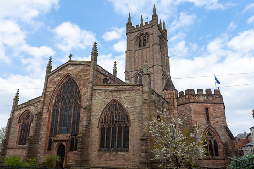

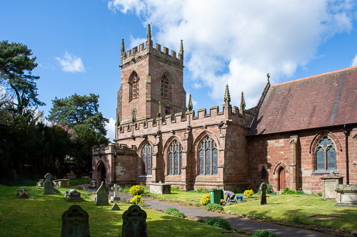

*15: A transom is a transverse horizontal structural beam or bar, or a crosspiece separating a door from a window above it. This contrasts with a mullion, a vertical structural member.*

*16: Brattishing or brandishing is a decorative cresting which is found at the top of a cornice or screen, panel or parapet. The design often includes leaves or flowers, and the term is particularly associated with Tudor architecture.*

*17: An ogee is the name given to objects, elements, and curves that have been variously described as serpentine, extended S  or sigmoid-shaped. Ogees consist of a 'double curve', and are the combination of two semicircular curves or arcs that, as a result of a point of inflection move from concave to convex or vice versa,  the ends of the overall curve point in opposite directions (and have tangents that are approximately parallel).*

*18: A Tudor arch is a four-centered arch which is a low, wide type of arch with a pointed apex. Its structure is achieved by drafting two arcs which rise steeply from each springing point on a small radius, and then turning into two arches with a wide radius and much lower springing point.*

## 16th and 17th Century (Tudor and Stuart)

The building of churches across England came to an abrupt halt at the end of the reformation (16th Century).  During the reign of Elizabeth I the only church construction in Shropshire was the rebuld of the chancel at St James, Shipton and the build of the puritan chapel at Langley (dated either 1564 or 1601).

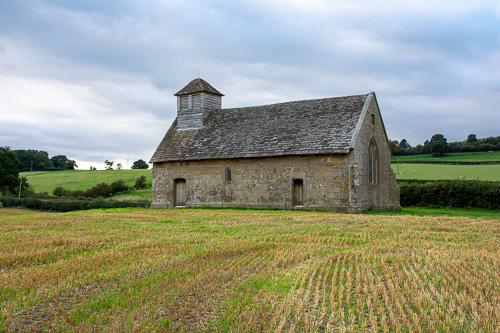

In the 17th Century, a small number of churches were built (or rebuilt or otherwise repaired after the Civil War) in Shropshire, but these were done in the Gothic style, despite the fact that there was a move to the classical style (being led by Inigo Jones).

St John the Baptist, Stokesay, was destroyed during the English Civil War; the current church is a rare example of a church extensively rebuilt during the Puritan period (1654) although some Norman features survive.

St Bartholomew, Benthall, originally was a chapel which was destroyed in the Civil War - the present church was built to replace it. The church is considered to be a fine example of a restoration era (the post Civil War Stuart period) church.

The Jacobean style is the second phase of Renaissance architecture in England, which followed the Elizabethan style. It is named after King James I of England, with whose reign (1603–1625 in England) it is associated. At the start of James’ reign there was little stylistic change in architecture, as Elizabethan trends continued. However, James' death in 1625 coincided with a decisive change towards more classical architecture, with Italian influence, which was led by Inigo Jones. The style is sometimes called Stuart architecture, or English Baroque.

In 1689, Holy Trinity, Minsterley was the first church in Shropshire to be built on classical lines (and the first in the county to be built of brick).

## 18th Century (Georgian)

Several new churches were built in Shropshire in the 18th Century, these churches were built for Protestant worship (which puts more emphasis on the preaching of the Word and less on the sacraments and so chancels were made smaller).  During this period, many of the village churches were built of brick with stone dressings.  In some cases a Georgian tower was added to a medieval church.

Georgian architecture is characterised by proportion and balance, it was based on the symmetry and proportion of the classical architecture of Greece and Rome.

Anglican churches that were built in the Georgian era were designed internally to allow maximum audibility, and visibility, for preaching, so the main nave was generally wider and shorter than in medieval plans, and often there were no side-aisles. Galleries were common in new churches. The external appearance generally retained the familiar signifiers of a Gothic church, with a tower or spire, a large west front with one or more doors, and very large windows along the nave, but all with any ornament drawn from the classical vocabulary.

Where funds permitted, a classical temple portico with columns and a pediment might be used at the west front. Interior decoration was generally simple or restrained; however, walls often became lined with plaques and monuments to the more prosperous members of the congregation.

Some example of Georgian churches in Shropshire are: St Alkmund, Whitchurch, St Catherine, Eyton-upon-the-Weald-Moors, St Laurence, Preston-upon-the-Weald-Moors.

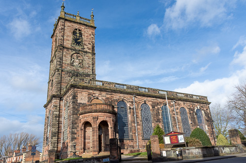

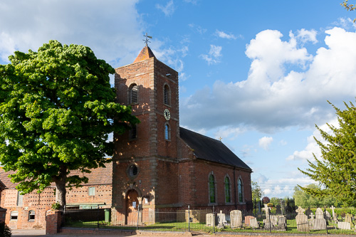

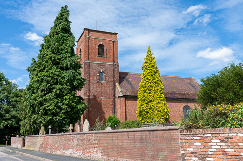

Georgian architecture was unpopular in the 19th Century, consequently the Victorian restorers often drastically altered the character of the buildings.  Also, chancels were often extended or rebuilt after the High-Church revival to reflect the increased emphasis on the 'correct' administration of the sacraments.

## The Greek Revival (c. 1790 - 1836)

The Greek Revival was championed in England by two young architects following a visit to Athens (then part of the Ottoman empire) for the study of Greek architecture.

A small number of churches were build during this period in Shropshire, the most notable ones being All Saints, Wellington, St Chad, Shrewsbury, St Mary Magdalene, Bridgnorth and St Michael, Madeley (the former two by James Stuart, one of the young architects who visited Athens, and the latter two by Thomas Telford).

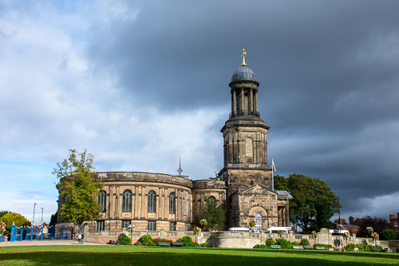

## 19th Century (The Gothic Revival  & Victorian)

The Gothic Revival was actually underway before Queen Victoria's reign, the first church to be built under this movement was St Alkmund, Shrewsbury (the church was demolished and rebuilt, but the existing tower and spire retained).  Only two other churches were build in Shropshire in the 19th Century prior to the Victorian era, one is now closed and the other is St George, Pontesbury (the tower and nave were rebuilt in the Early English style following the collapse of the original tower).

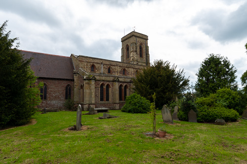

In the early 19th Century the Church was at a low ebb, there was social unrest and dissent, brought on the Napoleonic Wars and the industrialisation that was happening at the time. The Methodists moved away from the Church of England and established their own organisation.  As a result in 1818, the Church founded the Church Building Society and in the same year Parliament passed the Church Building Act.  This provided significant money for new churches to be built.  At the same time, architects were looking back at medieval Gothic architecture, and under Augustus Pugin, a revolution in this style was established.

Consequently, during Victoria's reign, nearly every Anglican church was built in the Gothic style.  Also, there was an explosion of church building in Shropshire on a scale not seen since the 12th Century.

Between 1830 and 1849, 33 churches were built, mostly in the (relatively plain) Early English style, a few in the neo-Norman (emulates works of the 11th and 12th century Romanesque in Britain and Norman France) style (Grinshill, All Saints, 1839-1840 is a good example of this) and a few in the disappearing Classical style.  The churches were mostly by local architects, the most prolific of these was Edward Haycock snr, who was responsible for about 13 churches, the best of which are Cressage (Christ Church, 1841) and Dorrington (St Edward, 1845).  Arguably the finest church of the 1840s is Broseley (All Saints, 1845), which, unusually for this time, is built in the Perpendicular style.

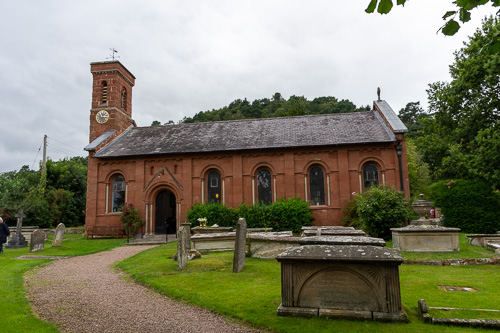

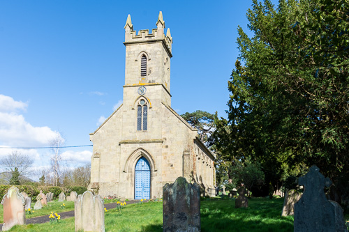

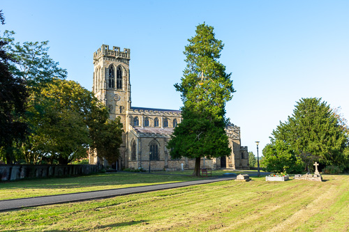

In the mid-Victorian era (c. 1850 to 1879), church design in Shropshire caught up with the more ambitious designs of the Decorated style already established and being used in London and elsewhere. During this time, 44 churches were built in Shropshire, of which 26 were in the Decorated style, most of the rest were in the Early English style (which was passing out of fashion) and just 2 were in the Perpendicular style. Many more of Shropshire's churches in the mid-Victorian era were by architects with national practices.  Some churches of note are: Sir George Gilbert Scott's church at Welshampton (St Michael and All Angels, 1860s), George Edmund Street's church at St George's (considered to be the outstanding church of the mid-19th Century), George Edmund Street's church at Withington (St John the Baptist, 1874) and Sir Arthur Blomfield's church at Jackfield (St Mary, 1863).  Several regional architects created churches of note also, one example being Edward Haycock jnr's church at Meole Brace (Holy Trinity, 1867 to 1868).

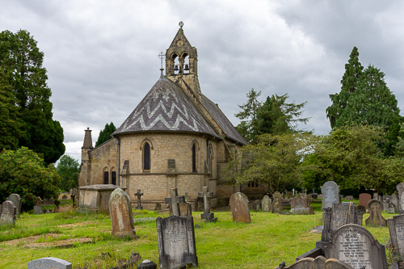

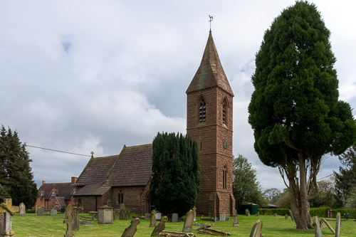

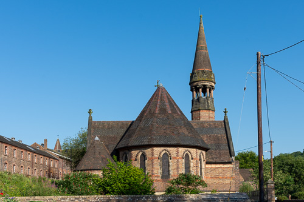

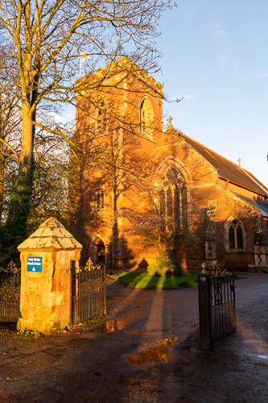

Church building in Shropshire slowed down in the last 20 years of the Victorian era; the last to be built in Shropshire in the 19th Century was All Saints, Richard's Castle (Batchcott).  Although this church is Gothic, it does not adhere to any particular medieval period, there are elements of the Decorated and Perpendicular styles in this church.

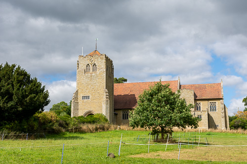

## 20th Century

Church building in Shropshire continued in the 20th Century, but at a much reduced rate.  Throughout the Century, designs became contemporary and modern.

The first churches to be built after the Victorian era were St Michael, All Stretton (1902) and All Saints, Little Stretton (1903).  These are the final two churches to be included in this project.

# References

The Churches of Shropshire and Their Treasures, John Leonard

[https://en.wikipedia.org/wiki/Anglo-Saxon_architecture](https://en.wikipedia.org/wiki/Anglo-Saxon_architecture)

[https://en.wikipedia.org/wiki/Norman_architecture](https://en.wikipedia.org/wiki/Norman_architecture)

[https://en.wikipedia.org/wiki/English_Gothic_architecture](https://en.wikipedia.org/wiki/English_Gothic_architecture)

[https://en.wikipedia.org/wiki/Georgian_architecture](https://en.wikipedia.org/wiki/Georgian_architecture)

[https://en.wikipedia.org/wiki/Church_architecture_in_England](https://en.wikipedia.org/wiki/Church_architecture_in_England)

[https://www.explorechurches.org/woven-in-time](https://www.explorechurches.org/woven-in-time)

[https://www.greatenglishchurches.co.uk/html/what_to_look_for_in_churches.html](https://www.greatenglishchurches.co.uk/html/what_to_look_for_in_churches.html)

[https://www.happydaystravelblog.com/english-churches-an-introduction/](https://www.happydaystravelblog.com/english-churches-an-introduction/)
